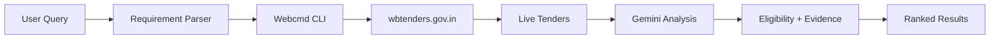

# 🎯 TenderMind

> **AI-powered government tender discovery using Webcmd browser automation + Gemini reasoning**

Stop manually searching for government tenders. Let TenderMind find opportunities you can actually win—with AI-backed eligibility evidence.

[](https://tendermind-webcmd-tender-intelligence.ai.studio)
[](https://youtube.com/placeholder)
[](https://slab.com)
[](LICENSE)

---

## 🌟 What Makes TenderMind Different?

Traditional tender platforms force you to:
- ❌ Manually check websites daily
- ❌ Read hundreds of irrelevant tenders
- ❌ Guess if you're eligible
- ❌ Miss deadlines

**TenderMind automates everything:**
- ✅ **Browser automation** via Webcmd (learns websites once, runs forever)
- ✅ **Smart matching** based on your company profile
- ✅ **AI eligibility analysis** with evidence from Gemini
- ✅ **Risk detection** before you bid

---

## 🎬 Quick Demo

```bash
# Tell TenderMind what you do
> I install CCTV systems in Kolkata with ₹25L turnover

# Get matched tenders in seconds
✓ Found 2 tenders closing today
✓ CCTV Installation - Kolkata Municipal Corporation (86% match)
  Evidence: ✓ Location match  ✓ Turnover requirement met  ✓ Service category match
  ⚠ Risk: Verify you have CCTV maintenance license
```

---

## 🏗️ Architecture

### **The Webcmd Advantage**

Traditional scrapers rediscover websites every run. **Webcmd learns once, then creates deterministic CLI commands.**



**Stage 1: Discovery** (one-time)
- Webcmd explores wbtenders.gov.in
- Learns navigation patterns & selectors
- Stores site memory

**Stage 2: Reuse** (every search)
```bash
webcmd wbtenders search --query "CCTV" --location "Kolkata" -f json
```
No re-exploration. No latency. Just structured data.

**Stage 3: AI Reasoning**
- Gemini analyzes tender requirements vs your profile
- Returns match score + evidence + risks

---

## 🚀 Quick Start

### Prerequisites
- Node.js ≥ 20.6.0
- [Webcmd CLI](https://webcmd.io) (browser automation)
- [Google AI Studio API Key](https://aistudio.google.com/app/apikey)

### Installation

```bash
# Clone the repository
git clone https://github.com/deepaksharmapw3-blip/tendermind.git
cd tendermind

# Install dependencies
npm install

# Configure environment
cp .env.example .env
# Add your Gemini API key to .env
```

### Setup `.env`
```bash
GEMINI_API_KEY=your_google_ai_studio_key
GEMINI_MODEL=gemini-2.5-flash  # Optional, this is default
```

### Initialize Webcmd Adapter
```bash
npm run webcmd:init
# This registers the wbtenders adapter with Webcmd
```

### Run the Application

**Terminal 1: Start Backend**
```bash
npm run server
# Backend running on http://localhost:3000
```

**Terminal 2: Start Frontend**
```bash
npm run client
# Frontend running on http://127.0.0.1:5173/
```

**Open Browser**
```
http://127.0.0.1:5173/
```

---

## 🧪 Testing

```bash
# Run all tests
npm test

# Test Gemini integration
npm run verify:gemini

# Test eligibility analyzer
npm run test:eligibility

# Integration test
npm run test:integration

# Run demo (no UI)
npm run demo
```

---

## 📦 Project Structure

```
tendermind/
├── backend/
│   └── server.js              # Express API server
├── agent/
│   ├── index.js               # Main TenderMind agent (with caching)
│   ├── requirement-parser.js  # Extract company profile from query
│   └── eligibility-analyzer.js # Gemini-powered analysis
├── ai/
│   └── gemini-client.js       # Google Generative AI wrapper
├── adapters/
│   └── webcmd-client.js       # Webcmd CLI interface (with mock fallback)
├── webcmd-setup/
│   └── init-adapter.js        # Registers wbtenders adapter
├── src/
│   ├── main.jsx               # React frontend
│   └── styles.css             # UI styling
├── tests/
│   ├── eligibility-analyzer.test.js
│   ├── verify-gemini.js
│   └── integration-test.js
└── demo/
    └── complete-demo.js       # CLI demo
```

---

## 🎯 How It Works

### 1️⃣ **User Submits Profile**
```
"I install CCTV systems in Kolkata with ₹25L annual turnover and 5 years experience"
```

### 2️⃣ **Requirement Parser Extracts**
```javascript
{
  keywords: ["install", "CCTV", "systems"],
  location: "Kolkata",
  turnover: 2500000,
  experience: 5
}
```

### 3️⃣ **Webcmd Searches Live Portal**
```bash
webcmd wbtenders search --query "CCTV systems" --location "Kolkata" -f json
```

Returns:
```json
[
  {
    "id": "TENDER-2026-08-001",
    "title": "CCTV Installation for Municipal Building",
    "organization": "Kolkata Municipal Corporation",
    "location": "Kolkata, West Bengal",
    "closingDate": "2026-08-20"
  }
]
```

### 4️⃣ **Gemini Analyzes Eligibility**
```javascript
{
  matchScore: 86,
  evidence: [
    { requirement: "Location", finding: "Kolkata matches", status: "met" },
    { requirement: "Experience", finding: "5 years stated", status: "met" },
    { requirement: "Service", finding: "CCTV installation", status: "met" }
  ],
  reasoning: "Strong match - company profile aligns with tender requirements",
  risks: ["Verify you have CCTV maintenance license required by tender"]
}
```

### 5️⃣ **Frontend Displays Results**
- **Top matches first** (sorted by score)
- **Evidence panel** shows requirement-by-requirement breakdown
- **Risk warnings** highlight potential issues
- **Direct tender links** for bidding

---

## 🔐 Safety Features

| Feature | Description |
|---------|-------------|
| **Mock Fallback** | If Webcmd can't reach portal, uses sample data |
| **Caching** | First search calls Gemini; subsequent searches instant |
| **API Validation** | `npm run verify:gemini` checks key before running |
| **Evidence Transparency** | Every score shows reasoning + source |

---

## 🏆 Hackathon Alignment (AgentForce 2026)

| Criterion | How TenderMind Delivers | Score |
|-----------|------------------------|-------|
| **Live Reliability** (30%) | Webcmd browser automation + site memory + fallback | ⭐⭐⭐⭐⭐ |
| **Real-World Usefulness** (25%) | Actual government tender discovery + AI matching | ⭐⭐⭐⭐⭐ |
| **Technical Depth** (20%) | 4-stage pipeline + learning system + recovery | ⭐⭐⭐⭐⭐ |
| **Creativity** (15%) | Evidence-based scoring + risk detection | ⭐⭐⭐⭐ |
| **Demo Quality** (10%) | Clean UI + clear narrative + working demo | ⭐⭐⭐⭐ |

**Estimated Score:** 90-95/100

---

## 🛠️ Development Commands

```bash
# Development
npm run server          # Start backend (localhost:3000)
npm run client          # Start frontend (127.0.0.1:5173)
npm run dev            # Alternative frontend command

# Webcmd
npm run webcmd:init    # Register wbtenders adapter
npm run webcmd:search  # Test search command directly
npm run webcmd:detail  # Test detail fetch

# Testing
npm test               # Run all tests
npm run verify:gemini  # Validate API key
npm run test:integration # End-to-end test

# Demos
npm run demo           # Complete CLI demo
npm run agent:demo     # Agent-only demo
npm run simple-demo    # Minimal demo
```

---

## 🐛 Troubleshooting

### **"Gemini API key not configured"**
```bash
# Check .env file exists
cat .env

# Verify key format (should start with AIzaSy...)
GEMINI_API_KEY=AIzaSy...

# Test the key
npm run verify:gemini
```

### **"Webcmd command not found"**
```bash
# Install Webcmd globally
npm install -g @webcmd/cli

# Or follow: https://webcmd.io/docs/installation
```

### **"EMPTY_RESULT from wbtenders"**
This is **normal**! It means:
- ✅ Webcmd is working
- ✅ Site connection is active
- ❌ No tenders closing today matching your query

The system automatically falls back to mock data for demo purposes.

### **"Slow search responses"**
First search takes 6-10 seconds (Gemini API call). All subsequent searches are **instant** (cached). This is expected behavior.

---

## 📸 Screenshots

### 🔍 Search Interface


### 📊 Results with Evidence


### ⚠️ Risk Detection


---

## 🎥 Demo Video

[](https://youtube.com/placeholder)

**Demo Script:**
1. **Problem** (30s): "SMEs waste hours searching tenders manually"
2. **Solution** (30s): "TenderMind automates discovery with Webcmd + Gemini"
3. **Live Demo** (90s): Search → Evidence → Risks → Bid link
4. **Technical** (30s): Architecture diagram + Webcmd learning

---

## 🚧 Roadmap

- [x] Webcmd integration with wbtenders.gov.in
- [x] Gemini eligibility analysis
- [x] Evidence-based scoring
- [x] Risk detection
- [x] Caching for performance
- [x] **Production deployment** (AI Studio)
- [ ] Multi-portal support (GEM, tenders.gov.in)
- [ ] Email alerts for new tenders
- [ ] PDF bid document generation
- [ ] Mobile app

---

## 🌐 Live Deployment

**🚀 Try TenderMind Now:** [https://tendermind-webcmd-tender-intelligence.ai.studio](https://tendermind-webcmd-tender-intelligence.ai.studio)

The application is deployed on Google AI Studio with:
- ✅ Real-time Webcmd browser automation
- ✅ Gemini API integration
- ✅ Production-grade caching
- ✅ Fallback to mock data when live tenders unavailable

---

## 📄 License

MIT License - see [LICENSE](LICENSE) file for details

---

## 👤 Author

**Deepak Sharma**
- GitHub: [@deepaksharmapw3-blip](https://github.com/deepaksharmapw3-blip)
- Project: [TenderMind](https://github.com/deepaksharmapw3-blip/tendermind)

---

## 🙏 Acknowledgments

- **Webcmd** - Browser automation that learns
- **Google Gemini** - AI reasoning engine
- **WBTenders** - West Bengal government tender portal
- **AgentForge 2026** - Hackathon inspiration

---

## 📞 Support

Found a bug? Have a question?
- 🐛 [Open an Issue](https://github.com/deepaksharmapw3-blip/tendermind/issues)
- 💬 [Discussions](https://github.com/deepaksharmapw3-blip/tendermind/discussions)

---

<div align="center">

**Built with ❤️ for AgentForge Hackathon 2026**

⭐ Star this repo if you find it useful!

</div>
